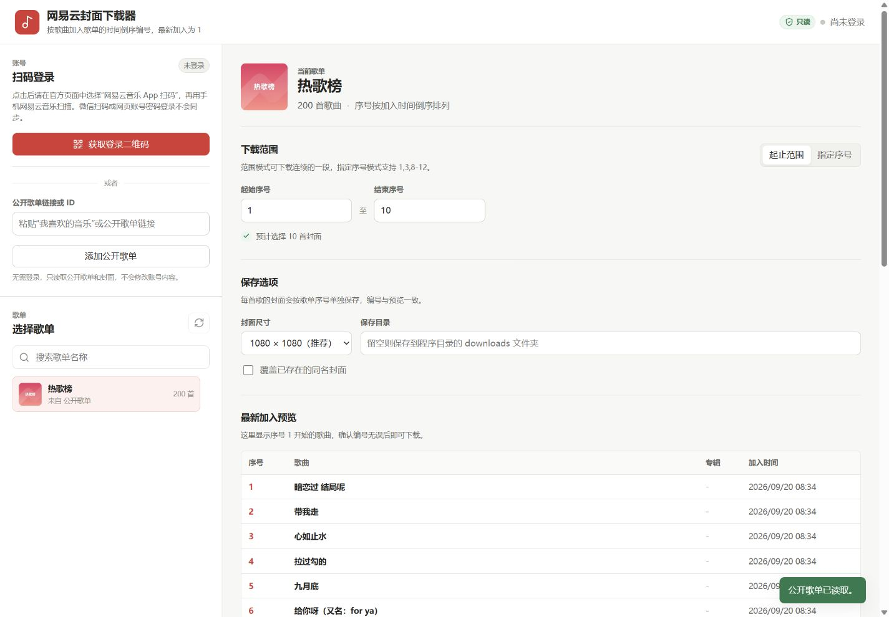

# 网易云封面下载器

一个本地运行、无需安装依赖的网易云音乐封面下载工具。支持扫码登录、公开歌单、按加入时间倒序编号、范围选择和指定序号选择。




## 功能特点

- 使用网易云音乐官方扫码页登录，不接触账号密码。
- 支持免登录读取公开歌单和公开的“我喜欢的音乐”。
- 按歌曲加入歌单的时间倒序编号，最新加入的歌曲是 `1` 号。
- 支持起止范围，例如 `1-100`。
- 支持指定序号，例如 `1,3,5-8,12`。
- 支持 `640 × 640`、`1080 × 1080` 和原始尺寸封面。
- 自动识别 JPG、PNG、WebP 等真实图片格式。
- 本地服务只监听 `127.0.0.1`，不向局域网或公网开放。
- 网易云请求强制使用只读 `GET` 端点白名单。

## 快速开始

### 环境要求

- Node.js 18 或更高版本
- Windows、macOS 或 Linux

不需要安装 npm 第三方依赖。

### Windows

双击：

```text
start.cmd
```

也可以在 PowerShell 中运行：

```powershell
.\start.ps1
```

### macOS 或 Linux

```bash
sh start.sh
```

### 使用 npm

```bash
npm start
```

程序启动后会自动打开：

```text
http://127.0.0.1:38471
```

如果默认端口被占用，程序会自动尝试后续端口。

## 使用方式

### 扫码登录

1. 点击“获取登录二维码”。
2. 在打开的网易云官方页面中选择“网易云音乐 App 扫码”。
3. 使用手机网易云音乐扫描并确认。

> 微信扫码或直接在网页中使用账号密码登录，不会把浏览器登录状态同步给本地程序。

### 公开歌单

如果不想扫码，可以把公开歌单链接或歌单 ID 粘贴到“公开歌单链接或 ID”输入框中。

也可以使用 URL 参数直接打开公开歌单：

```text
http://127.0.0.1:38471/?playlist=3778678
```

### 选择下载范围

- 起止范围：下载连续的一段，例如 `1` 到 `100`。
- 指定序号：下载任意位置，例如 `1,3,5-8,12`。

封面默认保存到：

```text
downloads\歌单名称_封面
```

也可以在界面中填写相对目录或绝对目录。

## 编号规则

程序读取歌单接口返回的 `at` 加入时间字段，并按时间从新到旧排序：

- 最新加入的歌曲是 `1` 号。
- 第二新加入的歌曲是 `2` 号。
- 没有加入时间字段的歌曲会保留在接口原始顺序之后。

文件命名示例：

```text
0001 - 歌曲名 - 歌手名.jpg
0007 - 歌曲名 - 歌手名.png
```

同一专辑中的不同歌曲会分别生成封面文件，因此可能出现多个文件内容相同的情况。这样能保证文件名编号与歌单序号一致。

## 只读安全说明

项目将“不修改账号内容”作为代码层约束：

- 网易云请求使用固定的只读端点白名单。
- 所有网易云请求强制使用 `GET`。
- 不支持请求体，不存在收藏、新增、删除、编辑歌单的代码路径。
- 扫码 Cookie 只保存在当前进程内存中，不写入配置文件。
- 本地 HTTP 服务只绑定 `127.0.0.1`。

详细说明见 [SECURITY.md](SECURITY.md) 和 [docs/architecture.md](docs/architecture.md)。

## 项目结构

```text
.
├─ server.js                 # 本地服务、登录、歌单读取和下载任务
├─ core.js                   # 排序、序号解析、文件名处理
├─ public/                   # 无构建步骤的本地网页界面
│  ├─ index.html
│  ├─ styles.css
│  └─ app.js
├─ test/
│  └─ core.test.js
├─ docs/
│  ├─ architecture.md
│  └─ screenshot.png
├─ .github/
│  └─ workflows/
│     └─ ci.yml
├─ start.cmd                 # Windows 双击启动
├─ start.ps1                 # PowerShell 启动
├─ start.sh                  # macOS / Linux 启动
├─ package-lock.json
├─ package.json
└─ README.md
```

## 开发

```bash
npm test
npm run check
```

`npm run check` 会执行 JavaScript 语法检查和全部核心逻辑测试。

## 已知限制

- 私密歌单必须使用扫码登录后才能读取。
- 网易云接口可能调整，若接口变更需要同步更新只读白名单和解析逻辑。
- 本项目只下载歌曲对应的专辑封面，不下载音频、歌词或 VIP 资源。

## 免责声明

本项目仅供个人学习和数据备份使用，与网易云音乐官方无关联。请遵守网易云音乐服务条款及所在地区的版权规定，不要将下载内容用于侵权、传播或商业用途。

## 为爱发电

这个项目由个人利用业余时间开发和维护，完全免费开源。如果它帮你节省了时间，欢迎在 GitHub 点一个 Star；如果愿意请我喝杯咖啡，也可以扫描下面的赞赏码。赞赏完全自愿，不会影响软件功能，也不会解锁额外内容。

<p align="center">
  
</p>

## 许可证

[MIT](LICENSE)

English documentation: [README.en.md](README.en.md)
